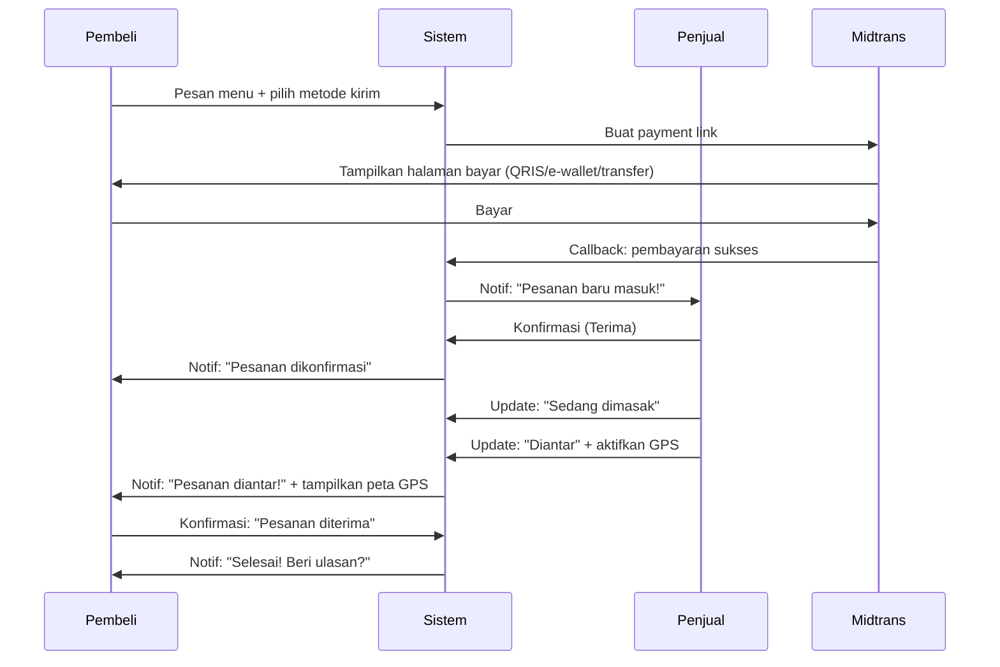
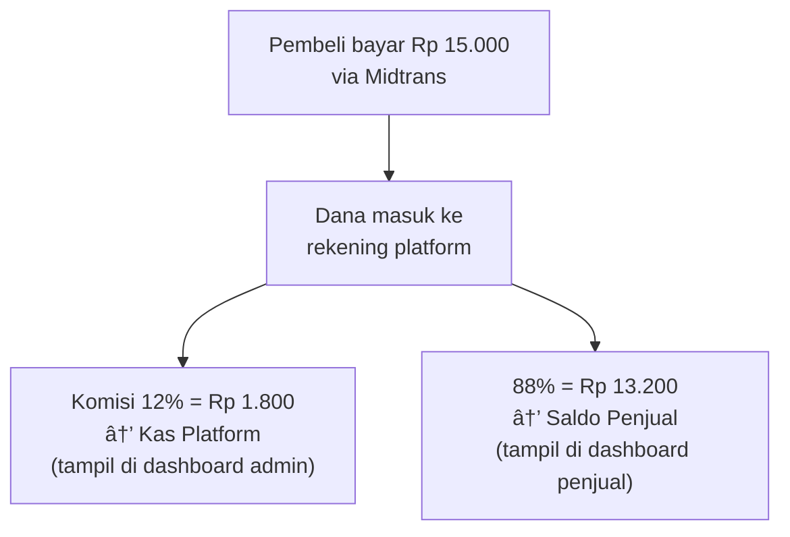
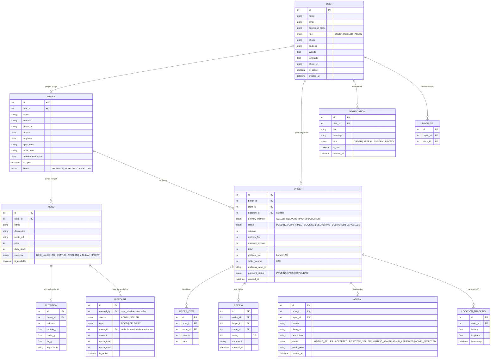

# 🍚 KosEats — Implementation Plan Final

> **Marketplace Masakan Rumahan Hiperlokal**
> "Gak Pake Ribet, Makanan Enak Langsung Mendarat di Kamar"

---

## Tech Stack

| Layer | Teknologi | Alasan |
|---|---|---|
| **Frontend** | Next.js (React) | SSR, routing bawaan, performa cepat |
| **Styling** | Vanilla CSS | Sesuai guideline, kontrol penuh |
| **Backend** | Node.js + Express | Ringan, cocok untuk REST API |
| **Database** | PostgreSQL | Relasional, cocok untuk transaksi keuangan |
| **ORM** | Prisma | Type-safe, migrasi mudah |
| **Auth** | JWT + bcrypt | Standar industri |
| **Payment** | Midtrans | Payment gateway Indonesia, support QRIS/e-wallet/transfer |
| **Maps** | Google Maps JavaScript API | Tracking real-time, $200 gratis/bulan (~28.500 loads) |
| **Real-time** | WebSocket (Socket.io) | Untuk GPS tracking + push notification |
| **Push Notif** | Firebase Cloud Messaging (FCM) | Push notification ke browser/HP |
| **File Upload** | Cloudinary / local storage | Upload foto menu & bukti banding |
| **Hosting** | Vercel (frontend) + Railway/Render (backend) | Free tier tersedia |

---

## Branding & Desain

| Elemen | Nilai |
|---|---|
| **Warna Primer** | Oranye Hangat `#D35400` |
| **Warna Sekunder** | Putih `#FFFFFF` |
| **Warna Teks** | Abu Gelap `#2C3E50` |
| **Warna Aksen** | Hijau `#27AE60` (sukses), Merah `#E74C3C` (error) |
| **Font** | Nunito / Poppins (rounded, friendly) |
| **Tone** | Santai, akrab, seperti kakak kos |

---

## 3 Role Pengguna

| Role | Deskripsi |
|---|---|
| **Pembeli** | Mahasiswa / anak kos yang pesan makanan |
| **Penjual** | Mitra UMKM / Ibu RT yang jual makanan |
| **Admin** | Pengelola platform KosEats |

---

## Arsitektur Halaman & Fitur Lengkap

### 🛒 PEMBELI

| Halaman | Fitur Detail |
|---|---|
| **Beranda** | Daftar menu dari penjual terdekat (radius < 1km), search bar, filter kategori, badge "Info Gizi ✓" di menu yang ada info gizi, label diskon jika ada |
| **Kategori** | 6 kategori: Nasi+Lauk, Lauk Saja, Sayur & Sup, Cemilan/Gorengan, Minuman, Paket Hemat |
| **Detail Menu** | Foto, harga, ~~harga coret~~ jika ada diskon, sisa kuota diskon, deskripsi, info gizi (kalori/protein/karbo/lemak/bahan — jika diisi penjual), rating, ulasan, tombol "Tambah ke Keranjang" |
| **Profil Toko** | Nama toko, foto, rating rata-rata, jam buka-tutup, jarak, semua menu penjual, ulasan terbaru |
| **Keranjang** | List pesanan, pilih metode kirim (Antar Penjual / Ambil Sendiri / Kurir Mitra), estimasi ongkir, total harga setelah diskon |
| **Checkout** | Ringkasan pesanan → Pembayaran via Midtrans (QRIS, e-wallet, transfer) |
| **Pesanan Aktif** | Status real-time: Dikonfirmasi → Dimasak → Diantar → Diterima. **Peta GPS** muncul saat status "Diantar" — lihat posisi pengantar |
| **Riwayat Pesanan** | Semua pesanan sebelumnya, tombol "Pesan Ulang", tombol "Beri Ulasan" |
| **Beri Ulasan** | Rating 1-5 bintang + komentar (hanya setelah pesanan selesai) |
| **Ajukan Banding** | Pilih alasan, upload foto bukti, tulis penjelasan → kirim ke penjual |
| **Status Banding** | Lihat progress: Menunggu Penjual → Diterima/Ditolak → Hubungi Admin → Keputusan Final |
| **Penjual Favorit** | List penjual yang di-bookmark |
| **Notifikasi** | 🔔 Lonceng di navbar + Push notification untuk: pesanan dikonfirmasi, diantar, selesai, banding direspon |
| **Profil** | Edit nama, alamat kos, nomor WA, foto profil |

---

### 🍳 PENJUAL

| Halaman | Fitur Detail |
|---|---|
| **Dashboard** | Ringkasan hari ini: total pesanan, pendapatan bersih (88%), pesanan aktif, rating toko |
| **Kelola Menu** | CRUD menu: nama, foto, harga, deskripsi, stok harian, kategori, **info gizi opsional** (kalori, protein, karbo, lemak, bahan utama) |
| **Kelola Diskon** | Buat diskon untuk menu sendiri: pilih menu → potongan harga → atur kuota (berapa orang) → aktifkan. Penjual yang tanggung biaya diskon |
| **Pesanan Masuk** | Terima / Tolak pesanan baru. Update status: Dikonfirmasi → Dimasak → Diantar/Siap Diambil → Selesai |
| **GPS Share** | Saat status "Diantar", penjual/kurir aktifkan share lokasi dari HP untuk tracking pembeli |
| **Banding Masuk** | Lihat banding dari pembeli → Terima (refund otomatis) / Tolak (pembeli bisa hubungi admin) |
| **Riwayat Transaksi** | Semua transaksi + pendapatan bersih (harga - komisi 12%) + status refund jika ada |
| **Ulasan** | Lihat semua rating & komentar dari pembeli |
| **Pengaturan Toko** | Nama toko, alamat, jam buka-tutup, foto, toggle Buka/Tutup, radius antar |
| **Notifikasi** | 🔔 Lonceng + Push: pesanan baru masuk, banding masuk, reminder stok |

---

### 🛡️ ADMIN

| Halaman | Fitur Detail |
|---|---|
| **Dashboard Overview** | **💰 ICON BESAR: Total Pendapatan Platform** (komisi 12% dari semua transaksi). Card: Total Transaksi, Total Pembeli, Total Penjual, Rating Rata-rata Platform |
| **6 Grafik Analitik** | (1) 📈 Tren Pendapatan per hari/minggu/bulan, (2) 📊 Volume Transaksi per hari/minggu, (3) 🏆 Top 5 Menu Terlaris, (4) ⏰ Jam Peak Order, (5) 👥 Pertumbuhan User, (6) ⭐ Distribusi Rating |
| **Daftar Transaksi** | Semua transaksi: pembeli, penjual, menu, harga, komisi platform, status, tanggal |
| **Kelola Penjual** | Approve/reject pendaftaran mitra baru, nonaktifkan penjual bermasalah, lihat detail toko |
| **Kelola Pembeli** | Daftar semua pembeli, nonaktifkan akun jika perlu |
| **Kelola Menu** | Moderasi menu: hapus menu tidak layak/melanggar |
| **Kelola Ulasan** | Moderasi: hapus ulasan spam/tidak pantas |
| **Kelola Diskon Platform** | Buat diskon dari platform: jenis (ongkir/makanan) → potongan → kuota → aktifkan. Admin bayar selisih (ke kurir jika diskon ongkir, ke penjual jika diskon makanan) |
| **Kelola Banding** | Lihat banding yang di-eskalasi ke admin (penjual tolak tapi pembeli hubungi admin). Admin review → Setujui (penjual WAJIB refund) / Tolak (final) |
| **Rekap Keuangan** | Detail pemasukan: komisi per transaksi, total komisi harian/mingguan/bulanan, pengeluaran diskon platform, saldo bersih |
| **Notifikasi** | 🔔 Lonceng + Push: penjual baru mendaftar, banding masuk, transaksi anomali |

---

## 💰 Alur Transaksi & Uang

### Alur Pesanan Normal



### Alur Uang



### Alur Diskon

```mermaid
graph TD
    subgraph "Diskon dari Penjual"
        A1["Penjual buat diskon<br/>Menu Rp 18.000 → Rp 15.000"] --> B1["Selisih Rp 3.000<br/>ditanggung PENJUAL"]
        B1 --> C1["Pembeli bayar Rp 15.000"]
        C1 --> D1["Komisi 12% dari Rp 15.000 = Rp 1.800"]
    end

    subgraph "Diskon Ongkir dari Admin"
        A2["Admin buat diskon ongkir<br/>Ongkir Rp 2.000 → Rp 0"] --> B2["Selisih Rp 2.000<br/>dibayar ADMIN ke kurir"]
    end

    subgraph "Diskon Makanan dari Admin"
        A3["Admin buat diskon makanan<br/>Menu Rp 15.000 → Rp 12.000"] --> B3["Selisih Rp 3.000<br/>dibayar ADMIN ke penjual"]
        B3 --> C3["Penjual tetap terima full<br/>88% × Rp 15.000"]
    end
```



### Alur Banding & Refund

```mermaid
graph TD
    A["Pembeli ajukan banding<br/>+ alasan + foto bukti"] --> B["Penjual review"]
    B -->|Terima| C["✅ Refund otomatis ke pembeli"]
    B -->|Tolak| D["Pembeli bisa 'Hubungi Admin'"]
    D --> E["Admin review kasus"]
    E -->|Setujui| F["✅ Penjual WAJIB refund"]
    E -->|Tolak| G["❌ Final, tidak ada refund"]
```



---

## 🗄️ Desain Database (Tabel Utama)



**Total: 12 tabel utama**

---

## 📁 Struktur Project

```
KosEats/
├── client/                    # Frontend (Next.js)
│   ├── app/
│   │   ├── (auth)/            # Login, Register
│   │   ├── (buyer)/           # Halaman pembeli
│   │   │   ├── home/          # Beranda + katalog
│   │   │   ├── menu/[id]/     # Detail menu
│   │   │   ├── store/[id]/    # Profil toko
│   │   │   ├── cart/          # Keranjang
│   │   │   ├── checkout/      # Checkout + Midtrans
│   │   │   ├── orders/        # Pesanan aktif + riwayat
│   │   │   ├── tracking/[id]/ # GPS tracking
│   │   │   ├── appeal/[id]/   # Ajukan banding
│   │   │   ├── favorites/     # Penjual favorit
│   │   │   └── profile/       # Profil pembeli
│   │   ├── (seller)/          # Halaman penjual
│   │   │   ├── dashboard/     # Dashboard penjual
│   │   │   ├── menu/          # Kelola menu + info gizi
│   │   │   ├── discounts/     # Kelola diskon
│   │   │   ├── orders/        # Pesanan masuk + status
│   │   │   ├── appeals/       # Banding masuk
│   │   │   ├── reviews/       # Ulasan
│   │   │   └── settings/      # Pengaturan toko
│   │   └── (admin)/           # Halaman admin
│   │       ├── dashboard/     # Overview + 6 grafik
│   │       ├── transactions/  # Daftar transaksi
│   │       ├── sellers/       # Kelola penjual
│   │       ├── buyers/        # Kelola pembeli
│   │       ├── menus/         # Moderasi menu
│   │       ├── reviews/       # Moderasi ulasan
│   │       ├── discounts/     # Diskon platform
│   │       ├── appeals/       # Kelola banding
│   │       └── finance/       # Rekap keuangan
│   ├── components/            # Komponen reusable
│   └── styles/                # Vanilla CSS
├── server/                    # Backend (Express)
│   ├── routes/                # API routes
│   ├── controllers/           # Business logic
│   ├── middleware/             # Auth, validation
│   ├── services/              # Midtrans, FCM, Socket
│   └── prisma/                # Schema + migrations
└── README.md
```

---

## 🚀 Tahap Development (5 Sprint)

### Sprint 1: Fondasi (Auth + Database + Layout)
- Setup project Next.js + Express + PostgreSQL + Prisma
- Desain database & migrasi
- Sistem auth (register/login) untuk 3 role
- Layout utama: navbar, sidebar, footer
- Halaman landing page

### Sprint 2: Fitur Inti Penjual
- CRUD menu + upload foto + info gizi opsional
- Pengaturan toko (jam buka, toggle buka/tutup)
- Dashboard penjual (ringkasan)
- Kelola diskon penjual

### Sprint 3: Fitur Inti Pembeli
- Beranda + katalog + filter kategori + search
- Detail menu + profil toko
- Keranjang + pilih metode kirim
- Checkout + integrasi Midtrans
- Pesanan aktif + status tracking
- Beri ulasan

### Sprint 4: Fitur Lanjutan
- GPS tracking real-time (Google Maps + WebSocket)
- Push notification (Firebase) + lonceng notif
- Sistem banding & refund (3 tahap)
- Diskon platform oleh admin + kuota
- Penjual favorit

### Sprint 5: Admin + Polish
- Dashboard admin + 6 grafik analitik
- Kelola penjual, pembeli, menu, ulasan
- Kelola banding (admin approve → penjual wajib refund)
- Rekap keuangan
- Responsive design (mobile-first)
- Testing & bug fixing

---

## Verification Plan

### Automated Tests
- Test auth: register, login, role-based access
- Test CRUD menu + info gizi
- Test alur order end-to-end
- Test perhitungan komisi 12% otomatis
- Test alur diskon (kuota habis → diskon hilang)
- Test alur banding 3 tahap

### Manual Verification
- Alur lengkap: Daftar → Login → Cari Menu → Pesan → Bayar (Midtrans) → Tracking GPS → Terima → Ulasan
- Verifikasi dashboard admin: total pendapatan, 6 grafik, kelola banding
- Verifikasi pembayaran Midtrans (sandbox mode)
- Responsive test di mobile

---

> [!IMPORTANT]
> **Ini adalah project yang cukup besar** (full-stack, payment gateway, GPS, real-time notification). Estimasi waktu development: **3-5 minggu** untuk semua fitur. Apakah ada deadline tertentu?

